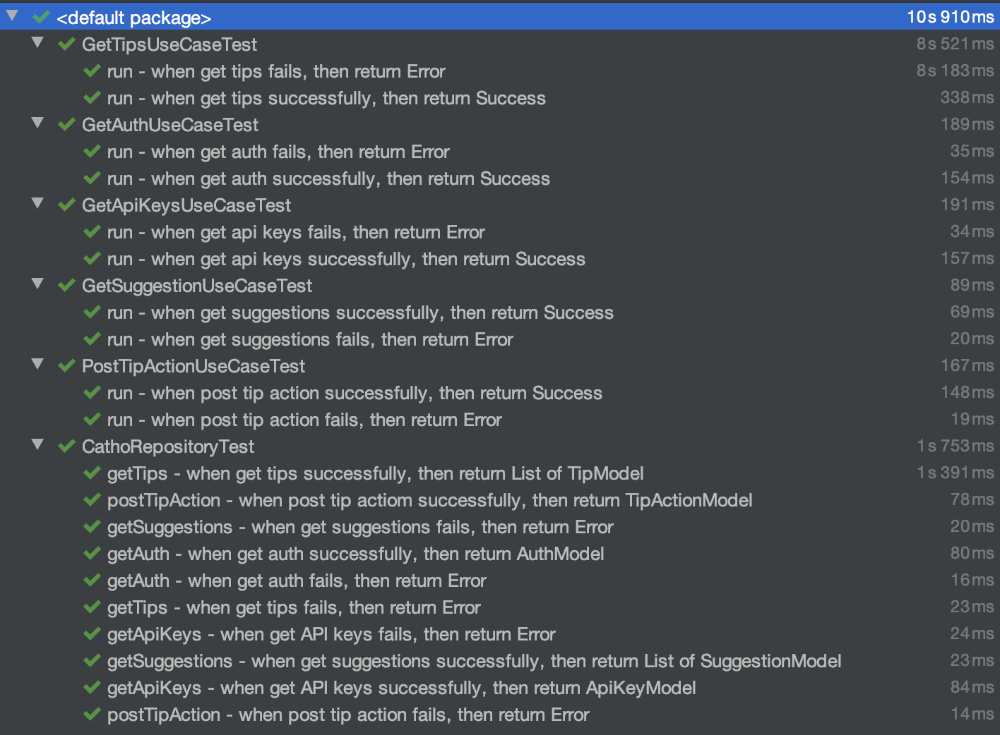

# catho-teste-app
Teste Catho

Gif com o app funcionando:

Testes unitários realizados:

Algumas imagens de exemplo com outras dicas carregadas e com os dois usuários:

**Tópicos principais que ainda não foram desenvolvidos:**
- Falta a criação de alguns testes unitários
- Falta o page indicator abaixo das sugestões de vagas
- O layout da lista de sugestões está ligeiramente diferente das especificações (o próximo card não está aparecendo antes do scroll horizontal ser realizado)

**Possíveis Melhorias**
- Criar uma camada de networking e serpará-la do repositório
- Tratar erros para cada seção do app separadamente (nome do usuário na toolbar, vagas e dicas)
